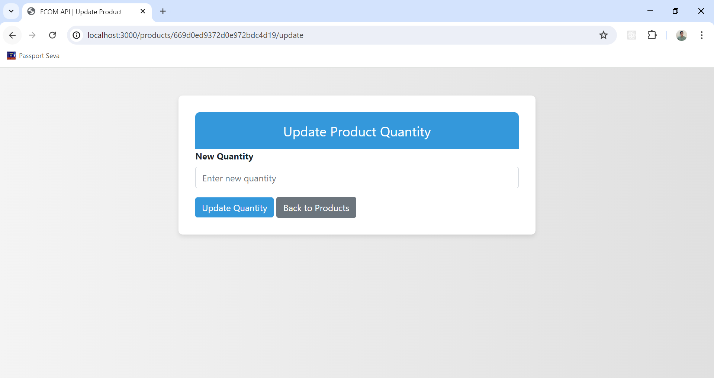

# Ecommerce Platform API

This API provides endpoints to manage productinventory for an ecommerce platform.
It utilizes Node.js with Express for the backend and MongoDB for data storage.

## Features

- Create, read, update, and delete (CRUD) operations for products.
- Update product quantities dynamically.
- Secure API endpoints with basic error handling.

## Live Site
[Click here](https://ecommerce-api-t8ix.onrender.com/products) to visit the live site.

## Prerequisites

Before you begin, ensure you have met the following requirements:

- Node.js installed on your local machine. You can download it from [nodejs.org](https://nodejs.org/).
- MongoDB installed and running locally or accessible via a remote server.

## Folder Structure

```csharp
ecommerce-api
├── config                    # MongoDB configuration
│   └── mongoose.js
├── controllers               # Controller logic
│   └── productController.js
├── images                    # Project Screenshots
├── models                    # Database models
│   └── productModel.js
├── routes                    # Route definitions
│   └── productRoutes.js
├── views                     # EJS views
│   ├── createProduct.ejs
│   ├── products.ejs
│   └── updateProduct.ejs
├── .env                      # Environment variables file
├── index.js                  # Express application setup
└── package.json
```

## Getting Started

To set up this project locally, follow these steps:

1. **Clone the repository**

2. **Install dependencies**
   ```bash
   npm install
   ```

- express
- mongoose
- ejs
- express-ejs-layouts
- dotenv

3. **Set up environment variables**

   Create a `.env` file in the root directory andprovide the following variables:

   ```plaintext
   PORT=3000
   MONGO_URI=mongodb://localhost:27017/ecommerce
   ```

   Adjust `PORT` and `MONGO_URI` as per your configuration.

4. **Start the server**

   ```bash
   npm start
   ```

   The server should now be running on `http:/localhost:3000/products`.

5. **Explore the API**
   Use tools like Postman or cURL to interact withthe API endpoints described below.

## API Endpoints

### Create a new product

- **URL:** `/products/create`
- **Method:** POST
- **Request Body:**

  ```json
  {
    "name": "laptop",
    "quantity": 10
  }
  ```

- **Response:**
  ```json
  {
    "product": {
      "name": "laptop",
      "quantity": 10
    }
  }
  ```

### Get all products

- **URL:** `/products`
- **Method:** GET
- **Response:**
  ```json
  {
    "products": [
      {
        "id": "1",
        "name": "laptop",
        "quantity": 10
      },
      {
        "id": "2",
        "name": "camera",
        "quantity": 5
      },
      {
        "id": "3",
        "name": "smartwatch",
        "quantity": 8
      }
    ]
  }
  ```

### Delete a product

- **URL:** `/products/:id`
- **Method:** DELETE
- **Response:**
  ```json
  {
    "message": "Product deleted"
  }
  ```

### Update product quantity

You can either increment or decrement the product quantity

- **URL:** `/products/:<id>/update_quantity?number=<number>`
- **Method:** POST
- **Response:**
  ```json
  {
    "product": {
      "id": "1",
      "name": "laptop",
      "quantity": 20
    },
    "message": "Updated successfully"
  }
  ```

## Detailed Code Overview

**config/mongoose.js** : Handles MongoDB connection using Mongoose.

**controllers/productController.js** : Contains the logic for handling requests to create, read, update, and delete products.

**models/productModel.js** : Defines the Mongoose schema and model for products.

**routes/productRoutes.js** : Defines the routes for product-related API endpoints and maps them to the controller functions.

**views/** : Contains the EJS templates for the frontend interface.

**Product List (views/products.ejs)** : Displays all products in a table with options to update or delete each product.

**Create Product Form (views/createProduct.ejs)** : Form to create a new product.

**Update Product Form (views/updateProduct.ejs)** : Form to update the quantity of an existing product.

**index.js** : Sets up the Express server, connects to MongoDB, and defines the routes.

**Styling** : The frontend interface is styled using Bootstrap for a clean and responsive design.

## Project Screenshot

1. **Product Inventory Page:**
   

2. **Add New Product Form:**
   
3. **Update Product Form:**
   

## Credits

This project was created by [Ravikant Singh](https://github.com/ravikantsingh12). Contributions via issues or pull requests are welcome!

## Follow me on

- [LinkedIn](https://www.linkedin.com/in/ravikant-singh-327a98241)
